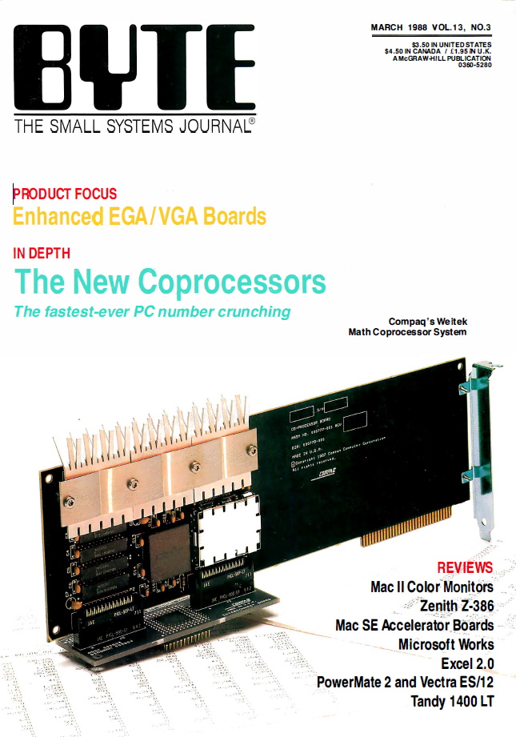

In the March 1988 issue, BYTE produced a in-depth section on math coprocessors for the PC. You can find a [PDF](https://archive.org/details/byte-magazine-1988-03) and [raw text scan](https://archive.org/stream/byte-magazine-1988-03/byte-magazine-1988-03_djvu.txt) of the issue at the [Internet Archive](https://archive.org/); the section itself begins on page 223 of the PDF.

The article "Avoidng Coprocessor Bottlenecks" by Mauro Bonomi included a C program (PDF page 228) to demonstrate the improvements a math coprocessor can make to render a beach ball using Phong shading techniques in EGA (640x350) resolution. As noted in the article, it takes 8 minutes to render the image on a Compaq Deskpro 386/20 (20-MHz) using floating-point emulation, 28 seconds with the addition of the 80387 coprocessor, and finally, 10 seconds with the Weitek 1167.

The C program was written for the MetaWare High C 1.4 compiler as it could produce output specifically for the Weitek 1167. Unfortunately, neither that version of the compiler or the Weitek processor are readily found.

The goals here are to:

1) Reproduce the text of the article for online reading;

2) Reproduce the original C listing;

3) Clean up the C listing for compatibility with other C compilers;

4) Translate the C listing to Turbo Pascal;

5) Use different compilers, languages, and harware to produce benchmarks.
