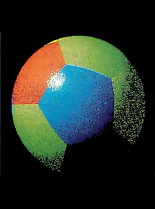

# Avoiding Coprocessor Bottlenecks, Mauro Bonomi

**BYTE, March 1988, Vol. 13, No. 3, Pages 200, 202, & 204**
[https://archive.org/details/byte-magazine-1988-03](https://archive.org/details/byte-magazine-1988-03)

**Compiling: An Example**

The beach ball picture shown in photo 1 was generated on a 20-MHz Compaq Deskpro 386/20 with an EGA graphics card. The C code for this simple graphics example is presented in listing 1. The program uses the Phong shading technique to compute the intensities and colors of the surface of the ball. The idea behind this technique is to compute normal (perpendicular) vectors to each point on the surface using an interpolation scheme and then apply the shading model at each pixel displayed.

[**Photo 1:**](phong-ball-shading.png) *The beach ball.*

The program involves a large number of floating-point computations on single-precision numbers, including the four basic instructions (add, subtract, multiply, and divide), as well as special functions (sine, cosine, and square root). The C program was compiled with a MetaWare High C compiler that supports both the Weitek 1167 and the 80387 coprocessor. The compiler generates either 80387 or Weitek 1167 object code. Users choose the desired coprocessor by setting a special switch on the command line when giving the compile command.

Running without a floating-point coprocessor, with the 80386 emulating 80387 instructions, the program takes 8 minutes to complete. Adding a 20-MHz 80387 reduces the execution time to a little more than 28 seconds. Finally, the Weitek memory-mapped coprocessor cuts execution time by about 3 times, down to only 10 seconds. The 200 percent performance improvement was achieved by simply recompiling the source code with no hand-coded optimizations.

Samples of the compiler output for both the 80387 and the Weitek 1167 are provided in listings 2 and 3. When compiled for the 80387, the code line `s=r*r-s*s` is translated into the code stream in listing 2.

The same equation is translated into 1167 memory moves by the compiler when the Weitek coprocessor is selected. The Weitek object code shown in listing 3 makes efficient use of coprocessor registers. The equation result `s (s=r*r-s*s)`, for example, is not stored back into the 80386 but is left in the coprocessor register file and is then used by the instruction `(x=b+a*sqrt(s))` , thus minimizing the data transfers between the microprocessor and the coprocessor and freeing up the system bus.

**Programming for Performance**

When writing high-level language code for a memory-mapped coprocessor, some simple techniques can lead to significant performance· improvements in the compiled code. First, variables used only in specific subroutines can be defined as local variables. The compiler then allocates such variables to coprocessor registers and will not store them back to main memory at the end of each instruction.

In the case of the 1167, the assembly language programmer has access to special instructions not otherwise available to compiler users. The multiply-accumulate (`wfmac`) instruction is an example. This instruction, useful in implementing matrix multiplications, specifies the multiplication of the two input operands, followed by the addition to a previously calculated partial result. A single memory move can then specify two floating-point instructions (multiply and add), further decreasing the burden on the system bus.

Additional assembly-level instructions that can improve the system performance are block moves-that is, moves of blocks of data to or from adjacent memory locations. A block move effectively encodes a stream of floating-point instructions. It is useful in loading and unloading the entire contents of the coprocessor register file, as well as in implementing vector adds and multiplies.

**Boiling Down**

Accelerating floating-point performance boils down to more than just clock rates and the size of machine words. We need the hardware assistance of dedicated ALUs and multipliers. But equally important is the need for efficient ways to move data and instructions between the main processor and the math coprocessor.

Removing the coprocessor instruction stream from the data bus-using the address bus to transmit op codes – leaves more room for passing operands. This strategy is one way to increase data bus bandwidth and improve processor/coprocessor interaction. •

**[Listing 1](phong-ball-shading.c)**: The C code to generate the beach ball. (Code written by Bruce Holloway of Weitek.)

**[Listing 2](phong-ball-listing-2.txt)**: Sample of compiler output for the 80387.

**[Listing 3](phong-ball-listing-3.txt)**: Sample of compiler output for the Weitek 1167.
